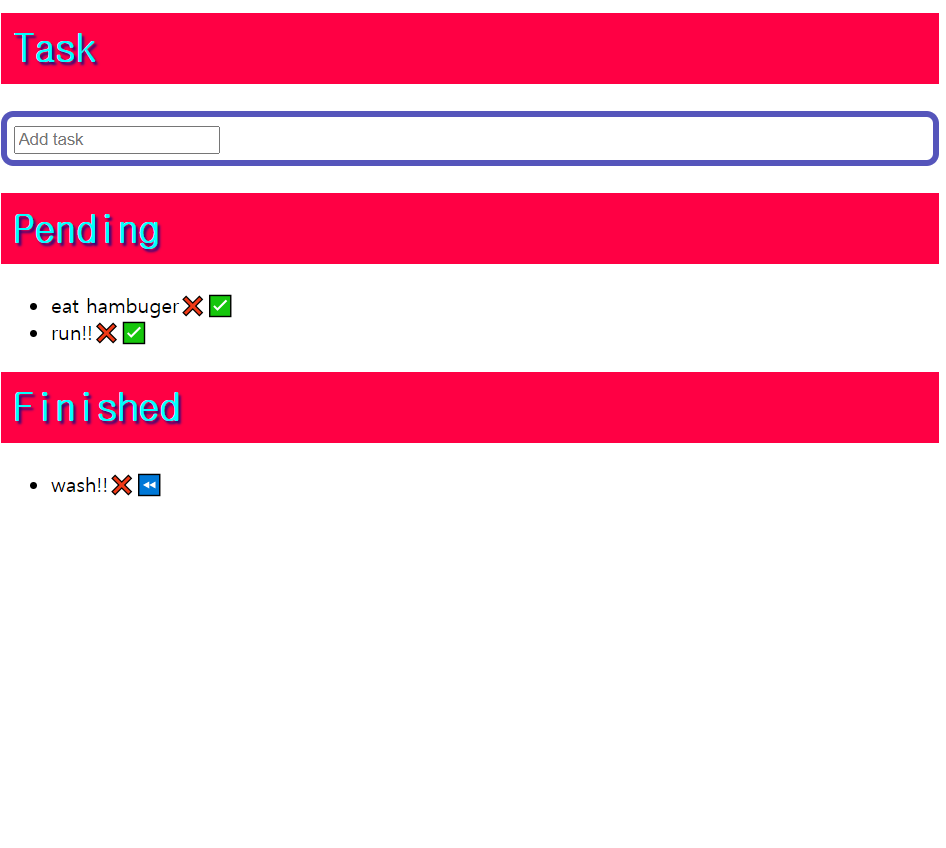

# :pencil2:Let-s-study
study hard !!

공부한것을 기록합니다.

### Calculate
기본적인 계산기 마크업해보기.

***
### Country
어디지역인지 선택.

***
### Momentom-Clone
Momentom을 클론 코딩.
### 사용 언어
+ HTML
+ CSS
+ JAVASCRIPT

***
## ToDoWorld
할 일을 기록할 수 있는 기본적인 투두 리스트입니다.

***
### WhenIsChristmas

크리스마스가 얼마나 남았는지를 알려줍니다.
크리스마스가 다가오는 즐거움을 느낄 수 있습니다.

### 사용 언어
+ HTML
+ CSS
+ JAVASCRIPT

***
### cote
코딩테스트 준비 .... 

***
### randomnumber

